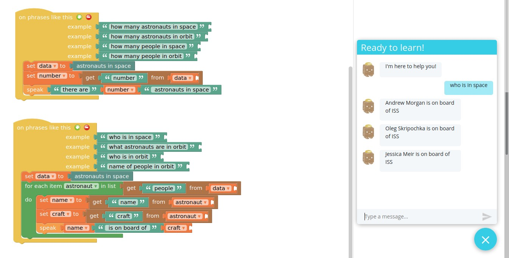

# Astronauts - Chatterbox Skill

Find out who is currently in orbit

Using chatterbox web_apis extensions you can query http://open-notify.org/Open-Notify-API/

Examples

    "Who is in space?"
    "How many people in orbit?"

